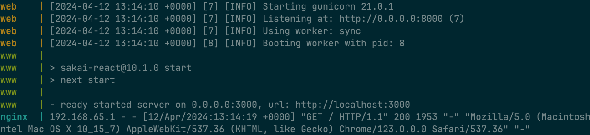

# README

Before you start. Check if have Docker and Git ready to use.

If not:

[https://docs.docker.com/engine/install/](https://docs.docker.com/engine/install/)

After you have set Docker and Git, clone the project to your local repository.
## Make sure Port: 3000,8000 are free.
Under the same repository of the ‘docker-compose.yml’ run following command in your terminal:

```jsx
docker-compose up --build
```



You should access page with URL: 127.0.0.1

### Poster
